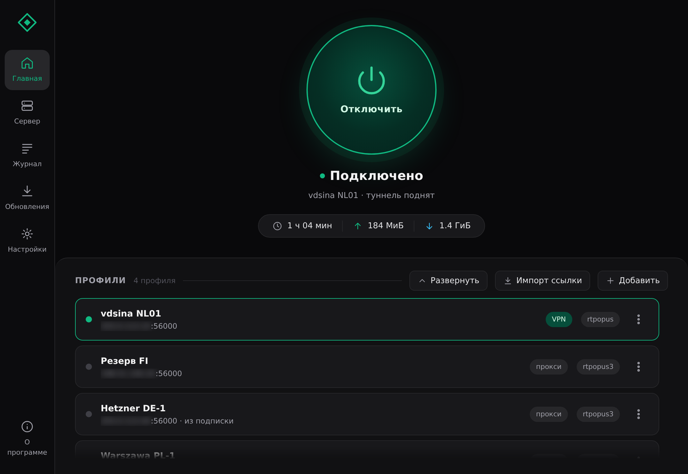
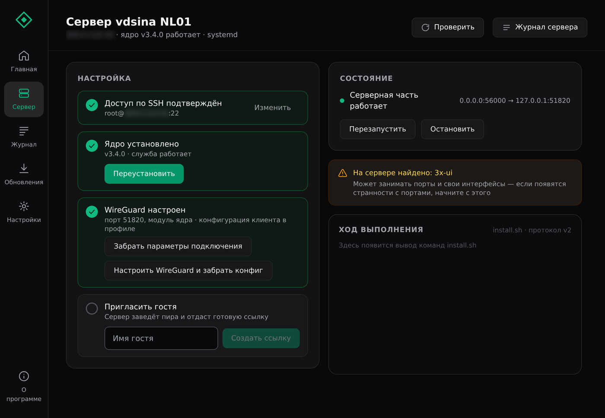
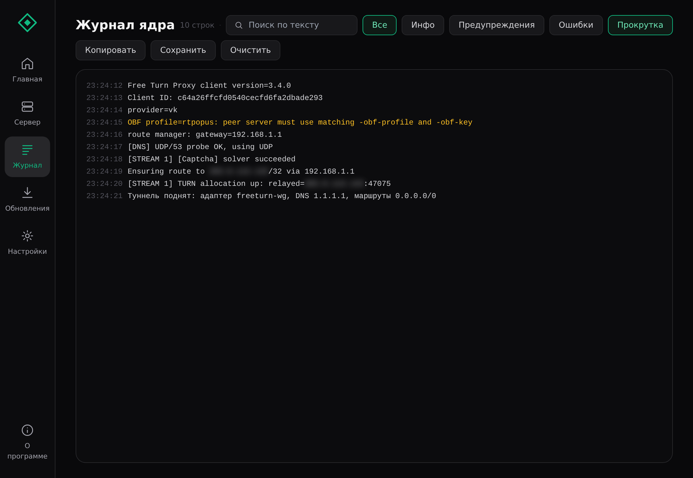
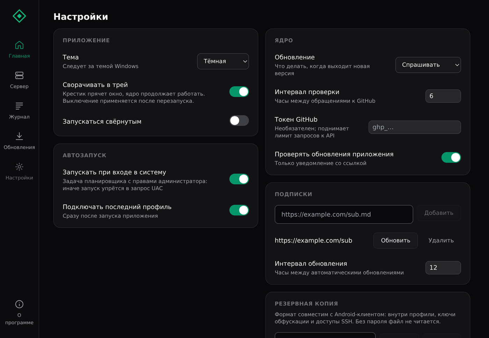

# FreeTurn для Windows

Десктопный клиент ядра [free-turn-proxy](https://github.com/samosvalishe/free-turn-proxy):
профили, ссылки `freeturn://`, установка на VPS по SSH и встроенный туннель —
одним `.exe`, без командной строки.

| | |
|---|---|
|  |  |
|  |  |

На снимках демонстрационные данные, адреса дополнительно размыты.

> **Disclaimer.** Проект предназначен **исключительно для образовательных и исследовательских целей.**

## Возможности

- **Несколько профилей серверов** — добавление, правка, клонирование
- **Импорт и экспорт** — ссылки `freeturn://` с QR-кодом, подписки, бэкапы (совместимы с Android-клиентом)
- **Режим работы прокси / VPN** (WireGuard) — туннель поднимает само приложение
- **UDP-релей до TURN** — бэкенд на сервере только UDP (WireGuard / AmneziaWG)
- **Быстрая установка на VPS** — по SSH, вместе с настройкой WireGuard
- **Приглашение гостей** одной ссылкой
- **Все флаги ядра через интерфейс**, редкие — в «Дополнительно»
- **Раздельное туннелирование** (на Windows — по подсетям)
- **Живой журнал ядра** с фильтром, поиском и выгрузкой
- **Автообновление ядра** из релизов GitHub с проверкой SHA256 и откатом
- **Значок в трее**, автозапуск, автоподключение, тема по системной

## Требования

- **Windows 10 или 11, x64**
- **Права администратора** — без них ядро не добавит маршруты к TURN-серверам
- **WebView2** — в Windows 11 уже есть, иначе приложение даст ссылку на установщик
- **VPS**
- **Ссылка на звонок**

Ядро и драйвер сетевого адаптера приложение скачивает само — ставить их отдельно не нужно.

## Установка

Скачайте `FreeTurn.exe` со страницы
[релизов](https://github.com/kamilsmtv/freeturn-windows/releases), положите в любую
папку на локальном диске и запустите. Установщика нет, рядом с собой приложение
ничего не пишет: настройки и журналы лежат в `%APPDATA%\FreeTurn\`.

> [!NOTE]
> Файл не подписан сертификатом, поэтому Windows покажет предупреждение
> SmartScreen: «Подробнее» → «Выполнить в любом случае». Проверить, что скачан
> именно наш файл, можно по `checksums.txt` из того же релиза:
> `certutil -hashfile FreeTurn.exe SHA256`.

Дальше — [подробное руководство](docs/guide.md): быстрый старт, режимы работы,
честный список ограничений Windows и совместимость с Android-клиентом.

## Благодарности

- **[@samosvalishe](https://github.com/samosvalishe)** — ядро [free-turn-proxy](https://github.com/samosvalishe/free-turn-proxy)
  и Android-клиент [turn-proxy-android](https://github.com/samosvalishe/turn-proxy-android),
  откуда взяты модель профилей, формат ссылок и бэкапа
- **[amneziawg-go](https://github.com/amnezia-vpn/amneziawg-go)** — реализация WireGuard/AmneziaWG для встроенного туннеля
- **[Wintun](https://www.wintun.net/)** — драйвер виртуального адаптера от WireGuard LLC

## Лицензия

[GPL-3.0](LICENSE)
